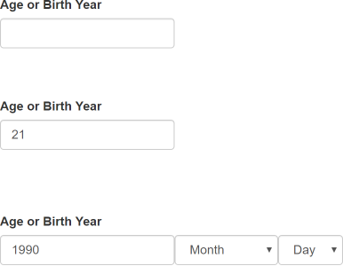

# Age Picker

Enhance `input` tags for collecting age with optional date selection, triggered by entering a year.

All age picker DOM assets will be wrapped everything inside container `div`s, including existing `input` tags. Initially invisible `select` tags will be added for choosing month and day. These dropdowns will occupy space while hidden to avoid UI related reshuffling.

## Example



## Installation

TODO
<!--
```
npm install age-picker
```
-->

## Quickstart

```html
<label for="age">Age or DOB</label>
<input type="text" id="age" name="age" data-age-picker />
```

```javascript
new AgePicker().init();
```

## Usage

- Decorate the `input` tags with a `data-age-picker` attribute.
- Run `new AgePicker().init();`, optionally specifying the scope in the parameter *(defaults to `document.body`)*.

Configuration options can be specified in the `AgePicker` constructor. Example:

```javascript
new AgePicker({
  selectClasses: ['form-control']
}).init();
```

## Configuration options

| Option             | Description                                                               | Default Value |
| ------------------ | ------------------------------------------------------------------------- | ------------- |
| `defaultDomScope`  | The default DOM scope to scan for `dataAttribute` items.                  | `document.body` |
| `dataAttribute`    | The `data-` attribute to scan for.                                        | `'data-age-picker'` |
| `prefixClass`      | The prefix for CSS classes used by other configuration CSS classes.       | `'age-picker'` |
| `containerClass`   | The container class surrouding the age picker and all related DOM assets. | ``${this.configuration.prefixClass}-container`` |
| `monthSelectClass` | The `select` tag to select the month.                                     | ``${this.configuration.prefixClass}-month`` |
| `daySelectClass`   | The `select` tag to select the day.                                       | ``${this.configuration.prefixClass}-day`` |
| `selectClasses`    | An array of custom classes to apply to month and day `select` elements.   | `[]` |
| `i18n`             | Internationalization data, defaults to US English.                        | `{ months: [...] }` |

## Methods

### `init(domScope = this.configuration.defaultDomScope)`

Scan the `domScope` and wire up any elements matching `this.configuration.dataAttribute`.

### `create(element)`

Create the age picker assets targeting `element`. Used by `init()`.

## Events

**Note:** Events should be used rather than listening for `keyup`, `change`, etc. on the `<input data-age-picker>` tag, since a hidden input becomes the source of truth for the over-the-wire 'age'.

### `ageChanged`

Raised on the `input` element when the age is changed or cleared by any forms of user input (both direct entry and year, month, day inputs).

## Notes

Our use cases dictate collecting the month and day from the user. However, other or future use cases may allow for using today's date. By using today's date with a provided year age could be calculated. This feature does not currently exist, but was considered.

Currently supports [Gregorian calendar](https://en.wikipedia.org/wiki/Gregorian_calendar) using English language only. Additional languages can be supported by overriding the `i18n` configuration.

## Development

- `npm install`
- `npm run build` or `npm run watch`, then open `demo/index.html` in a browser.
- `npm test` to run tests.
- `npm run lint` to run linter.

## License

MIT
